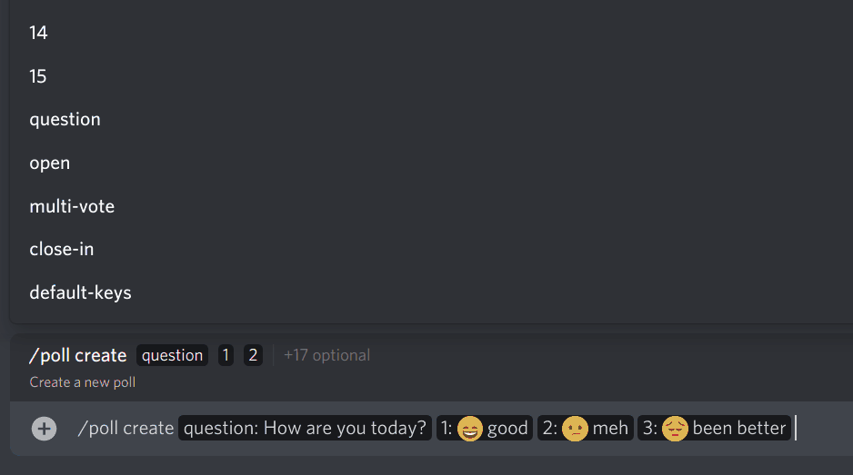

# instant-poll

instant-poll is a [Discord](https://discord.com) application that allows you to create polls with live feedback in text channels. 



## Features
- No setup required, just plug and play
- Real-time updating poll results
- Cutting-edge Discord features (slash commands, message buttons)
- Timed Polls
- Polls with multiple votes per user
- Dynamic Polls (adding options as you go)
- Open (non-anonymous) polls
- Restricted polls (only certain roles can participate)
- Gateway-free (you don't need to invite the bot to use it)

## Add it to your server

[**Add the official bot**](https://discord.com/oauth2/authorize?client_id=489108697864470531&scope=applications.commands)

You will notice that, when you've authorised the app, it **will not join your server**. This is **intended**, **you can use the commands anyway**.
You can verify this by typing `/poll info`.

## Usage
Use `/poll create` to create a poll. 

| Parameter              | Description                                                                 | Constraints                               |
|------------------------|-----------------------------------------------------------------------------|-------------------------------------------|
| `question`             | The poll question                                                           | /                                         |
| `1`..`15`              | The options voters can pick from                                            | Format: `<emoji>? <key>? ; <description>` |
| `voter-role`           | A role people must have in order to participate                             | Any existing role                         |
| `allow-change-options` | Whether it should be possible to add more options after creation            | True or False                             |
| `show-votes`           | Whether it will be visible who voted for which option(s)                    | always, never or after closing            |
| `multi-vote`           | Whether every voter can pick multiple options                               | True or False                             |
| `close-in`             | Number of seconds after which poll is closed                                | positive number, <= 0 will be ignored     |
| `default-keys`         | Whether to use option keys A-O automatically. May improve mobile formatting | True or False                             |


Polls can be closed by the poll creator and people who are allowed to delete messages.

## Hosting
You can host this application yourself using [Docker](https://docker.com). Further prerequisites:
- A Discord application with a bot user (https://discord.com/developers/applications)
- Domain with an SSL certificate
- Reverse proxy such as nginx.

### Setup

#### Installation

This installation guide assumes basic familiarity with using a Linux server.

1. Clone the repository and enter it
   ```bash
   git clone https://github.com/JohnnyJayJay/instant-poll
   cd instant-poll
   ```
2. Edit `config/config.template.edn` to include the public key and token of your Discord app. You can find both of these on your [applications page](https://discord.com/developers/applications).
3. `mv config/config.template.edn config/config.edn`


#### Proxy Setup
The application will run a web server that accepts Discord requests at any URI. You should set up your reverse proxy to forward requests to your domain
(or a specific URI, if you want) to the Docker container.

The port to forward to on your local host is chosen by Docker by default, so you'll have to set that after you started the container (see `docker ps`). 
Alternatively, you can set a fixed port by changing this: `- "8090"` to `-"<your-port>:8090"` in `docker.compose.yml`, where `<your-port>` is the
port that you want your reverse proxy to forward to.

#### Slash Commands Registration

Run the following command to register instant-poll's commands globally for your bot:

``` bash
docker compose run -e UPDATE_COMMANDS=1 server`
```

You should see a confirmation in the logs.

#### Updating

To update to the latest version of instant-poll, run

``` bash
git pull
docker compose build 
```

If there are changes to the set of commands provided by instant-poll, you have to [re-register them](#Slash-Commands-Registration).

Restarting the bot works via `docker compose down` and then [running](#Run) again.


### Run

To start the app, run `docker compose up` or `docker compose up -d` to start in detached mode.

If it's your first run, you need to tell Discord where to send interactions now. Again, you can to that on the developer portal in your application's page. Set "Interactions Endpoint URL" to whereever your server accepts requests and save your changes.

Depending on when you registered the slash commands, you may have to wait up to an hour before you can use the commands in your servers. Once they're available, check `/poll info` to see if it works.

## License

Copyright © 2021-2023 JohnnyJayJay

Licensed under the [MIT License](./LICENSE).
